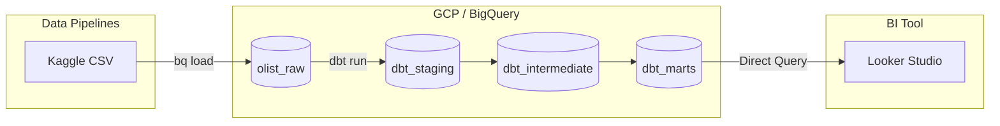

## はじめに

転職ポートフォリオとして、ブラジルの大手Eコマースプラットフォーム **Olist** の公開データセットを活用し、**「配送遅延がカスタマーレビュー品質（顧客満足度）に与える地理的・時系列的な影響」** を分析・可視化するデータパイプラインおよびBIダッシュボードを構築しました。

本記事では、データ取り込みからdbtによるモデリング、Looker Studioでのダッシュボード構築に至る技術設計と、そこから得られたインサイトを解説します。

* **完成ダッシュボード**: [Looker Studio リンク](https://datastudio.google.com/s/qw_toxEKwdg)
* **GitHubリポジトリ**: [oranegewimps/shimo-data](https://github.com/oranegewimps/shimo-data)

---

## 全体アーキテクチャ

本プロジェクトでは、拡張性と保守性を考慮し、モダンデータスタックの標準的な構成を採用しています。



---

## 技術スタック

| レイヤー | 採用ツール / ライブラリ | 選定理由・役割 |
|---------|----------------------|-------------|
| DWH | BigQuery (GCP) | 大規模データの高速集計、サーバーレスでの運用容易性 |
| Data Transformation | dbt-bigquery (v1.11.1) / dbt-core (v1.11.7) | データモデリング、リポジトリ管理、データ品質テスト |
| BI / 可視化 | Looker Studio | BigQueryとの親和性、インタラクティブなマップ描画 |
| 認証・セキュリティ | OAuth 2.0 | 個人開発環境における安全なGCP認証基盤 |

---

## データセット概要

- **データソース**: [Olist Brazilian E-Commerce Dataset (Kaggle)](https://www.kaggle.com/datasets/olistbr/brazilian-ecommerce)
- **規模**: 約10万件の注文データ（2016年〜2018年）
- **構造**: 注文、商品、顧客、販売者、レビュー、決済、配送などを含む関連9テーブル

**分析テーマ**: 「配送遅延の地域的偏りと、それがレビュー評価（1〜5点）に与える定量的な影響の解明」

---

## GCP / BigQuery環境構成

BigQuery内ではデータ品質とライフサイクル管理を考慮し、データセットを段階的に分離しています。

```
olist-ecommerce-shimodata (GCP Project)
├── olist_raw                        # 生データ（CSVから直接ロード）
├── dbt_default_olist_staging        # 型変換・カラム名正規化
├── dbt_default_olist_intermediate   # テーブル結合・ビジネスロジック計算
└── dbt_default_olist_marts          # BI用集計マート
```

### データロード (bq load)

データ取り込みは、CLIツールを用いて再現性を確保した形で実行しました。

```bash
bq load \
  --source_format=CSV \
  --skip_leading_rows=1 \
  olist_raw.orders \
  ./olist_orders_dataset.csv
```

---

## dbtによるデータモデリング設計

dbtの設計思想に基づき、Staging → Intermediate → Marts の3レイヤー構成を採用し、関心の分離（SoC）を徹底しました。

```
[olist_raw]
    └── stg_orders / stg_customers / stg_order_reviews ... (Staging)
             └── int_orders / int_geolocation (Intermediate)
                      └── mart_delivery_by_state / mart_monthly_orders ... (Marts)
```

### 1. Staging レイヤー

役割: 生データの型変換、日時フォーマットのタイムスタンプ化、カラム名の統一（ビジネスロジックは一切含めない）。

```sql
-- models/staging/stg_orders.sql
select
    order_id,
    customer_id,
    order_status,
    cast(order_purchase_timestamp as timestamp) as order_purchased_at,
    cast(order_delivered_customer_date as timestamp) as order_delivered_at,
    cast(order_estimated_delivery_date as timestamp) as order_estimated_delivery_at
from {{ source('olist_raw', 'orders') }}
```

### 2. Intermediate レイヤー

役割: 複数テーブルの結合、フラグ判定（配送遅延の有無など）のビジネスロジックの定義。

```sql
-- models/intermediate/int_orders.sql
select
    o.order_id,
    o.order_status,
    o.order_delivered_at,
    o.order_estimated_delivery_at,
    case
        when o.order_delivered_at > o.order_estimated_delivery_at then 1
        else 0
    end as is_late,
    r.review_score,
    c.customer_state
from {{ ref('stg_orders') }} o
left join {{ ref('stg_order_reviews') }} r using (order_id)
left join {{ ref('stg_customers') }} c using (customer_id)
where o.order_status = 'delivered'
```

### 3. Marts レイヤー

役割: BIツール（Looker Studio）に直接接続するための集約テーブル作成。

```sql
-- models/marts/mart_delivery_by_state.sql
select
    customer_state                              as state,
    count(order_id)                             as order_count,
    sum(is_late)                                as late_order_count,
    avg(review_score)                           as avg_review_score,
    avg(state_lat)                              as state_lat,
    avg(state_lng)                              as state_lng
from {{ ref('int_orders') }}
left join {{ ref('int_geolocation') }} using (customer_state)
group by customer_state
```

### データ品質管理 (dbt test)

プライマリキーの一意性・非空チェック、特定ドメイン値の許容テストを schema.yml に定義し、自動テストを導入しました。

```bash
$ dbt test
29 passed, 1 warned
```

※ 1件の警告は、一部の古い注文データにおけるレビュー内容テキストの欠損に関するものであり、分析ロジック上許容されるケースであることを確認済み

---

## Looker Studio ダッシュボード設計

### データソース設計

パフォーマンス確保のため、BigQuery側で集計済みのMartsテーブルをダイレクトに参照しています。

| データソース名 | 参照マートテーブル | 主なダッシュボード用途 |
|-------------|----------------|-------------------|
| DS-01 | mart_delivery_by_state | Googleマップ表示、州別遅延率・スコアランキング |
| DS-02 | mart_monthly_orders | 時系列トレンド（注文数・GMV） |
| DS-03 | mart_review_score_distribution | レビュースコアの分布表示 |
| DS-04 | mart_category_sales_top10 | カテゴリ別売上比較 |

### BI用計算フィールドの定義

Looker Studio側での適切な集計を保証するため、以下の計算フィールドを定義しました。

```
・全体遅延率:
  SUM(late_order_count) / SUM(order_count)  [形式: パーセント]

・加重平均レビュースコア:
  SUM(avg_review_score * order_count) / SUM(order_count)

・マップ位置情報:
  CONCAT(state_lat, ",", state_lng)  [形式: 緯度、経度]
```

---

## 分析結果とビジネスインサイト

### 1. 配送遅延の強い地域偏在性

**発見**: アラゴアス州（AL）で遅延率24%と極めて高い値を記録したほか、北東部・北部地域で遅延率が高水準となりました。一方で、サンパウロ（SP）など南東部の都市部は非常に低い遅延率に抑えられています。

**背景**: ブラジル国内の主要物流拠点・倉庫が南東部に偏在しており、広大な北部への長距離輸送におけるインフラボトルネックが浮き彫りになりました。

### 2. 配送遅延と顧客満足度の負の相関

全体平均のレビュースコアは **4.16 / 5.0** と好調である一方、遅延率が高い州ほど平均スコアが低下する傾向が明確に確認できました。顧客離脱を防ぐためには、遅延頻発地域における配送予定日の精度向上（または事前の期待値調整）が最優先課題であることがわかりました。

### 3. 売上成長トレンドと季節性

2016年末〜2018年にかけて注文数・GMVともに着実な拡大傾向を示しました。特に2017年11月はブラックフライデーキャンペーンの影響で急激なトラフィック増（月間売上ピーク）を記録しました。

---

## 実装における工夫とハマった点

### 工夫した点：複数座標を持つ郵便番号の集約

生データの geolocation テーブルでは、同一の zip_code_prefix に対して複数の緯度経度レコードが存在し、そのまま結合するとデータ増殖（ファンアウト）を引き起こす問題がありました。そのため、int_geolocation モデル内で一度 AVG() による代表値を算出し、データ整合性を担保しました。

```sql
-- models/intermediate/int_geolocation.sql
select
    zip_code_prefix,
    avg(geolocation_lat) as lat,
    avg(geolocation_lng) as lng
from {{ source('olist_raw', 'geolocation') }}
group by zip_code_prefix
```

### ハマった点：BIツール側での時系列集約バグ

Looker Studio上で集計済みの order_month（文字列/日付形式）を「年四半期」へ自動切り替えした際、BIツール側での重複再集計が発生し、グラフ表記が歪む問題に直面しました。

**対応策**: データソース側での過度な自動集計に頼らず、X軸のラベル表示間隔をビジュアル設定で調整することで、データ精度を損なわずに見栄えを最適化しました。

---

## まとめと今後の展望

| 指標項目 | 分析結果 |
|---------|---------|
| データ分析対象総注文数 | 約96,000 件 |
| 全体配送遅延率 | 8.1% |
| 加重平均レビュースコア | 4.16 / 5.0 |
| カバー地域 | ブラジル全 27 州 |

GCP + dbt + Looker Studio のモダンデータスタックを活用することで、**「生データからの自動モデリング → 品質テスト → BIツールでの意思決定支援」** に至る一貫したパイプラインを構築できました。

### 今後の改善・拡張アプローチ (Next Actions)

- **BigQueryコスト最適化**: 今後データ量が拡大した際に備え、`order_purchased_at` によるパーティショニングと、`customer_state` によるクラスタリングの導入。
- **CI/CDの構築**: GitHub Actionsと dbt Cloud (または dbt-ci) を連携させ、プルリクエスト時の自動 dbt test パイプラインを構築すること。

---

## 参考資料

- [Olist Brazilian E-Commerce Dataset - Kaggle](https://www.kaggle.com/datasets/olistbr/brazilian-ecommerce)
- [dbt Documentation](https://docs.getdbt.com/)
- [Google Cloud BigQuery Documentation](https://cloud.google.com/bigquery/docs)
